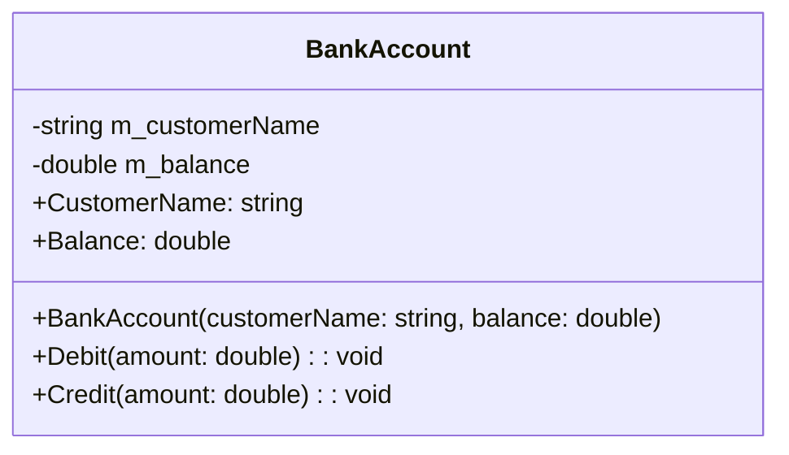

# Diagrama de Clases - Bank System

## Descripción de Clases

### BankAccount
Clase que representa una cuenta bancaria con funcionalidades básicas de débito y crédito.

**Propiedades:**
- `CustomerName`: Nombre del cliente propietario de la cuenta (solo lectura)
- `Balance`: Saldo actual de la cuenta (solo lectura)

**Métodos:**
- `Debit(amount)`: Debita un monto de la cuenta. Valida que el monto sea positivo y no mayor al saldo.
- `Credit(amount)`: Acredita un monto a la cuenta. Valida que el monto sea positivo.

**Validaciones:**
- Los montos negativos lanzan `ArgumentOutOfRangeException`
- Los débitos mayores al saldo disponible lanzan `ArgumentOutOfRangeException`